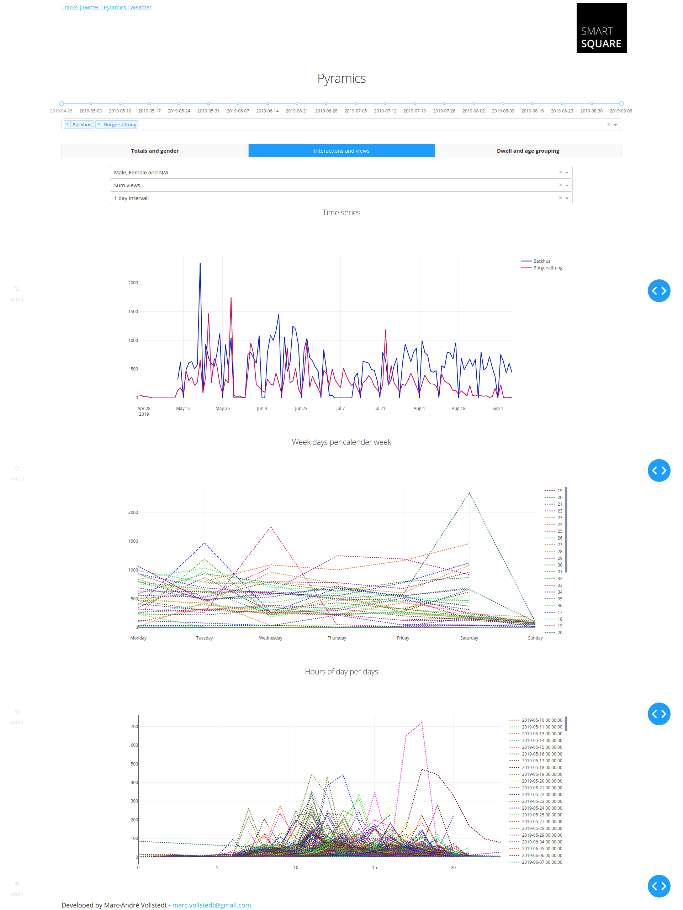

# MotionPathDashboard
Dashboard to analyse and vizualize detection and tracking results (using Dash by Plotly)

## Install

Install Dash

```
conda create --name dash python=3.6
conda activate dash
conda install ipykernel
python -m ipykernel install --user --name dash

pip install dash
pip install plotly --upgrade

pip install psycopg2
pip install geopandas

cd ~
git clone https://github.com/mavoll/MotionPathDashboard.git
```

Install PostGIS:

```
sudo sh -c 'echo "deb http://apt.postgresql.org/pub/repos/apt bionic-pgdg main" >> /etc/apt/sources.list'
wget --quiet -O - http://apt.postgresql.org/pub/repos/apt/ACCC4CF8.asc | sudo apt-key add -
sudo apt update
sudo apt install postgresql-11-postgis-2.5
sudo apt install postgis

sudo -u postgres psql
CREATE EXTENSION adminpack;
CREATE DATABASE gisdb;
\connect gisdb;
CREATE SCHEMA postgis;
ALTER DATABASE gisdb SET search_path=public, postgis, contrib;
\connect gisdb;
CREATE EXTENSION postgis SCHEMA postgis;

CREATE EXTENSION postgis_sfcgal SCHEMA postgis;

\password postgres
```
For more PostGIS configuration see [here](http://trac.osgeo.org/postgis/wiki/UsersWikiPostGIS24UbuntuPGSQL10Apt).

## Apps (created with Dash by Plotly) and tables

### Raw data

<p align="center">
  
</p>

Create table:
```
CREATE TABLE postgis.tracks_points_sec
(
    id integer NOT NULL,
    geom geometry(Point,5555),
    slice character,
    day character,
    cam character,
    part integer,
    subpart integer,
    track_id integer,
    track_class character,
    sec timestamp without time zone,
    "time" timestamp without time zone,
    PRIMARY KEY (id)
);

```
Use [import script](https://github.com/mavoll/MotionPathDashboard/blob/master/test_data/insert_csv_tracks_into_postgis_point_date_sec.py) to insert testdata from [csv file](https://github.com/mavoll/MotionPathDashboard/blob/master/test_data/tracks_data_hh/geo_ref_tracks.csv) into database:

`python test_data/insert_csv_tracks_into_postgis_point_date_sec.py -r 25 -y 1521027720 -e 'gisdb' -u 'postgres' -w 'postgres' -f 'test_data/geo_ref_tracks.csv' -t 'tracks_points_per_sec' -s 'Testdatensatz2' -d 'Testdatensatz2' -p 1 -b 1 -i 'localhost' -x 5432`

Components:
- Dropdown (multi select)
- Time RangeSlider
- Time Slider
- Scattermapbox
- DataTable
- Pie
- Scatter (mode='lines')

### Twitter data

<p align="center">
  
</p>

Create table:
```
CREATE TABLE postgis.twitter_points
(
    city text NOT NULL,
    year integer NOT NULL,
    month integer NOT NULL,
    username text,
    tweetid bigint NOT NULL,
    createdat timestamp without time zone NOT NULL,
    geom geometry(Point,4326) NOT NULL,
    PRIMARY KEY (createdat, tweetid)
);
```
Twitter data fetched from Casandra NoSQL database from [SparkPipeline](https://github.com/mavoll/SparkPipeline) and insert into postgis database (see [cass_to_postgis.py](https://github.com/mavoll/MotionPathDashboard/blob/master/test_data/cass_to_postgis.py)).


### Weather

<p align="center">
  
</p>

Create table:
```
sudo -u postgres psql gisdb

CREATE TABLE postgis.weather_hamburg_daily
(
  stations_id integer NOT NULL,
  date timestamp NOT NULL,
  qn_3 integer,
  fx float,
  fm float,
  qn_4 integer,
  rsk float,
  rskf integer,
  sdk float,
  shk_tag integer,
  nm float,
  vpm float,
  pm float,
  tmk float,
  upm float,
  txk float,
  tnk float,
  tgk float,
  PRIMARY KEY (stations_id, date)
);

CREATE TABLE postgis.weather_hamburg_hourly
(
  stations_id integer NOT NULL,
  time timestamp NOT NULL,
  v_te005 float,
  ff float,
  v_n integer,
  p float,
  r1 float,
  wrtr integer,
  rs_ind boolean,
  sd_s0 float,
  tt_tu float,
  rf_tu float,
  PRIMARY KEY (stations_id, time)
);
```
Use [import script](https://github.com/mavoll/MotionPathDashboard/blob/master/test_data/insert_weather_into_postgis_daily.py) to insert testdata from [daily data](https://github.com/mavoll/MotionPathDashboard/blob/master/test_data/weather_data_hh/daily/produkt_klima_tag_20180304_20190904_01975.txt) into database:

`python test_data/insert_weather_into_postgis_daily.py -e 'gisdb' -u 'postgres' -w 'postgres' -f 'test_data/weather_data_hh/daily/produkt_klima_tag_20180304_20190904_01975.txt' -t 'weather_hamburg_daily' -i 'localhost' -x 5432`

Use [import script](https://github.com/mavoll/MotionPathDashboard/blob/master/test_data/insert_weather_into_postgis_hourly.py) to insert testdata from [hourly data](https://github.com/mavoll/MotionPathDashboard/tree/master/test_data/weather_data_hh/hourly) into database:

`python test_data/insert_weather_into_postgis_daily.py -e 'gisdb' -u 'postgres' -w 'postgres' -f 'test_data/weather_data_hh/daily/produkt_klima_tag_20180304_20190904_01975.txt' -t 'weather_hamburg_daily' -i 'localhost' -x 5432`

Climate data Germany:
https://opendata.dwd.de/climate_environment/CDC/observations_germany/climate/

```
indicators_daily = {'fx': 'wind speed max', 'fm': 'wind speed average', 'rsk': 'precipitation sum', 
              'rskf': 'precipitation type', 'sdk': 'sun sum', 'shk_tag': 'snow sum', 
              'nm': 'cloud amount average', 'vpm': 'steam pressure average', 'pm': 'air pressure', 
              'tmk': 'temp average', 'upm': 'air humidity average', 'txk': 'temp max', 
              'tnk': 'temp min', 'tgk': 'soil temp 5cm min'}

indicators_hourly = {'v_te005': 'soil temp 5cm', 'ff': 'wind speed', 'v_n': 'cloud amount', 
              'p': 'air pressure type', 'r1': 'precipitation', 'wrtr': 'precipitation type', 
              'rs_ind': 'precipitation indicator', 'sd_s0': 'sun', 'tt_tu': 'temp', 'rf_tu': 'air humidity'}
              
Niederschlagsart:
0 -- kein Niederschlag
1 -- nur abgesetzte Niederschläge
2 -- nur flüssige abgesetzte Niederschläge
3 -- nur feste abgesetzte Niederschläge
6 -- Niederschlag in flüssiger Form
7 -- Niederschlag in fester Form
8 -- Niederschlag in flüssiger und fester Form
9 -- Niederschlagsmessung ausgefallen

Qualitätsniveau:
1 - nur formale Prüfung beim Entschlüsseln und
Laden
2 - nach individuellen Kriterien geprüft
3 - in ROUTINE mit dem Verfahren QUALIMET und
QCSY geprüft
5 - historische, subjektive Verfahren
7 - in ROUTINE geprüft, aber keine Korrekturen
8 - Qualitätsicherung ausserhalb ROUTINE
9 - in ROUTINE geprüft, nicht alle Parameter korrigiert
10 - in ROUT
```

### Pyramics

<p align="center">
  
</p>

<p align="center">
  
</p>

<p align="center">
  
</p>

Create table:
```
sudo -u postgres psql gisdb

CREATE TABLE postgis.pyramics
(
  id SERIAL,
  measurement text NOT NULL,
  sensor text NOT NULL,
  name text NOT NULL,
  type text NOT NULL,
  start_time timestamp NOT NULL,
  end_time timestamp NOT NULL,
  age integer,
  dwell integer,
  gender text,
  views integer,
  PRIMARY KEY (id)
);

```
Use [import script](https://github.com/mavoll/MotionPathDashboard/blob/master/test_data/insert_pyramics_into_postgis.py) to insert testdata from [pyramics data](https://github.com/mavoll/MotionPathDashboard/tree/master/test_data/pyramics_data_hh) into database:

`python test_data/insert_pyramics_into_postgis.py -e 'gisdb' -u 'postgres' -w 'postgres' -t 'pyramics' -i 'localhost' -x 5432`


## Start Dashboard

```
cd ~/GitHub/MotionPathDashboard
python index.py
http://127.0.0.1:8050/

```

### Create systemd services

```
cd /etc/systemd/system
sudo nano dash.service
sudo chmod -v 777 /etc/systemd/system/dash.service
```

dash.service file content:

```
[Unit]
Description=dash
After=network.target
After=syslog.target

[Service]
User=hcuadmin
Type=simple
WorkingDirectory=/home/hcuadmin/MotionPathDashboard
ExecStart=/usr/bin/python3 /home/hcuadmin/MotionPathDashboard/index.py
ExecStop=/bin/kill -9 $MAINPID
StandardOutput=syslog
StandardError=syslog
Restart=always
RestartSec=3

[Install]
WantedBy=multi-user.target
```

Reload:

```
sudo systemctl daemon-reload
sudo reboot
sudo systemctl start dash.service
sudo systemctl stop dash.service
sudo systemctl enable dash.service
sudo systemctl status dash.service
```

## Further development and research opportunities

## Authors

* **Marc-André Vollstedt** - marc.vollstedt@gmail.com

## Acknowledgments
